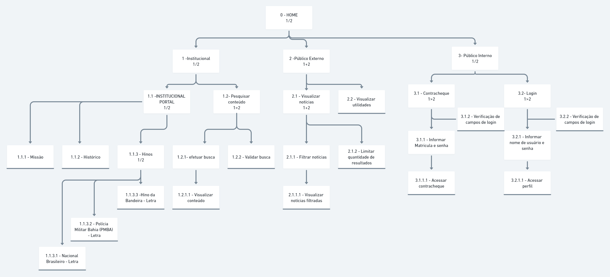

## 1. Introdução

Uma análise de tarefas tem o objetivo de compreensão do esforço dos usuários, com base no por quê e como realizam tal trabalho. Pode ser utilizada em diferentes etapas do desenvolvimento do produto, seja em um software existente ou um novo sistema, com apoio ou não de uma ferramenta computacional para que as soluções sejam consoante o que os usuários esperam do sistema/software. Os níveis de abstração muda conforme o contexto, em um projeto novo o nível de abstração é muito maior, pois irão existir muitos pontos em processo de definição.

## 2. Metodologia

A metodologia utilizada será a análise hierárquica de tarefas hierárquica, pois é uma excelente forma de aferir erros no processo de análise e serve também de entrada para outras análises futuras.

Esta metodologia foi desenvolvida na década de 60 com o objetivo de entender as competências e as habilidades exibidas em tarefas complexas que não se repetiam, e também auxiliar na identificação de problemas de desempenho. É uma excelente metodologia para identificar falhas ou incertezas no processo e serve de entrada para outras análises.

A análise hierárquica de tarefas examina primeiramente os objetivos de alto nível, como por exemplo uma reunião, e se decompôe em subobjetivos, por exemplo a data, local e participantes da reunião, buscando sempre identificar quais subobjetivos são mais difíceis de se atingir ou que geram mais erros, e que, portanto, limitam ou mesmo impedem o atingimento do objetivo maior.

Os subobjetivos de um objetivo e seus relacionamentos é denominada de **plano**. Um plano define os subobjetivos necessários para colocar um outro objetivo maior, e a ordem que esses subobjetivos devem ser atingidos.

Num nível mais baixo da hierarquia de objetivos, cada subobjetivo é alcançado por uma **operação**, que é a unidade fundamental desta metodologia.

As relações entre os subobjetivos são:

<strong>Author</strong>: Carlos Rafael

<strong>Exemplo de fluxos entre os objetivos

## 3. Diagrama HTA Geral do site

<strong>Author</strong>: Carlos Rafael

Diagrama geral de objetivos no site PMBA

Disponível em : [whimsical Link](https://whimsical.com/home-T6Dp9jefYawhh2mfteftur)

## 5. Conclusão

A construção do diagrama com a técnica HTA, permite compreender o trabalho do usuário na interface. Da forma em que foi feita, devido a quantidade de funcionalidades reduzidas do site, nos trás uma boa ideia de escopo e objetivos do usuário no sistema.

## 6. Referências

Disponível em: <https://usabilidade.unifei.edu.br/2020/01/analise-de-tarefas/> Acesso em: 24/02/22;
SIMONE DINIZ JUNQUEIRO BARBOSA, BRUNO SANTANA DA SILVA, Interação Humano-Computador, 1a Edição, p. 162 e 163.

## 7. Histórico de Versão

| Versão | Data       | Descrição                    | Autor(es)      |
| ------ | ---------- | ---------------------------- | -------------- |
| 1.0    | 24/02/2022 | Criação do documento         | Jackes Fonseca |
| 1.1    | 24/02/2022 | Introdução                   | Carlos Rafael  |
| 1.2    | 24/02/2022 | Metodologia                  | Herick Lima    |
| 1.3    | 27/02/2022 | + informações de metodologia | Herick Lima    |
| 1.4    | 27/02/2022 | + informações de introdução  | Carlos Rafael  |
| 1.5    | 06/04/2022 | Adicionando diagrama         | Carlos Rafael  |
